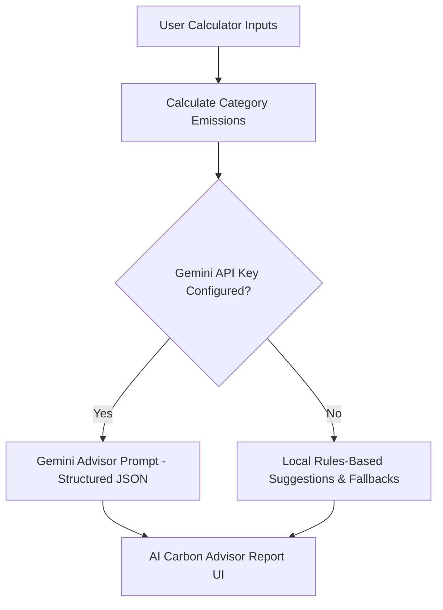

# EcoTrack Project Architecture & Technical Design

This document details the architectural layout, modules, and calculations of the EcoTrack platform.

---

## 1. Directory Structure

EcoTrack follows a Clean Architecture design organized around Next.js App Router directories in the root:

```
ecotrack/
├── app/                  # Application routing and page-level views
│   ├── analytics/        # Historical trend analysis & predictions
│   ├── calculator/       # Carbon calculator form & results
│   ├── challenges/       # Gamification tasks and points rewards
│   ├── journal/          # Daily offsets logging journal
│   └── settings/         # API credentials and style preferences
├── components/           # Reusable UI elements (Navbar, Cards, Charts, UI layout)
├── lib/                  # Isolated core domain & business logic
│   ├── constants.js      # Global emission factors & regional targets
│   ├── carbonCalculator.js # Mathematical calculations & projections logic
│   ├── aiSuggestions.js  # Rule-based suggestions and Gemini prompt integrations
│   ├── storage.js        # LocalStorage helpers for persistent offline caching
│   └── types/
│       └── schema.js     # TypeScript JSDoc contract declarations
├── __tests__/            # Comprehensive unit and integration test suite
└── public/               # Global static assets and leaflet map icons
```

---

## 2. Calculation Models

### 2.1 Carbon Calculator Calculations
All category emissions are calculated on a **monthly** basis in `lib/carbonCalculator.js`, based on regional India grid averages and standard emissions constants in `lib/constants.js`:

1. **Transport**:
   $$\text{Emission} = (\text{Daily Distance} \times \text{Commute Days} \times \text{Factor}) + \frac{\text{Flight Hours} \times 480 \times \text{Domestic Flight Factor}}{12}$$
   - Clean modes (walking, cycling) have a factor of `0` to prevent motorcycle emission fallback bugs.

2. **Energy**:
   - Estimated monthly kWh from utility bills is calculated using a regional average tariff (₹8/kWh in India).
   - AC usage is calculated based on seasonal usage and a standard 1.5-ton AC power rating.
   - Rooftop solar panels apply a **30% reduction** on the total household energy footprint.

3. **Food**:
   - Monthly diet footprint is based on dietary categories (Vegan, Vegetarian, Eggetarian, Non-Vegetarian).
   - Food waste adds $1.9 \text{ kg CO₂}$ per kg of food discarded.

4. **Shopping & Waste**:
   - Purchases of clothing and online delivery packages have fixed factors.
   - High-impact electronics (laptops, phones) are amortized over 12 months.
   - Landfill waste accumulates $0.5 \text{ kg CO₂/kg}$, while recycling provides a $-0.1 \text{ kg CO₂/kg}$ offset.

### 2.2 Mathematical Predictions
To project future footprint trends, EcoTrack uses a **Linear Regression Trend Model** on historical logs:
$$y = mx + c$$
Where:
- $x$ represents the chronological month index.
- $y$ represents the monthly total emissions in kg CO₂.
- The slope $m$ and intercept $c$ are calculated using the Least Squares Method:
  $$m = \frac{N\sum(xy) - \sum x \sum y}{N\sum(x^2) - (\sum x)^2}$$
  $$c = \frac{\sum y - m\sum x}{N}$$
This models the trend line and projects the output for month $N$, allowing the user to predict if their current sustainability habits will lead to emissions increases or decreases.

---

## 3. AI Carbon Advisor Flow

The AI suggestion system provides smart recommendations using a hybrid rule-based and LLM-assisted approach:



1. **Rule-Based Engine**: Stored in `lib/aiSuggestions.js`. Checks conditionals against individual inputs and returns localized tips sorted by total offset potential.
2. **Gemini Advisor Prompt**: Incorporates specific parameters and constraints to return a structured JSON report (detailed monthly action plans, financial savings, and category sub-scores).
3. **Data Privacy**: No Personally Identifiable Information (PII) is sent to external APIs. Only raw numeric metrics are sent, ensuring compliance with strict privacy guidelines.
