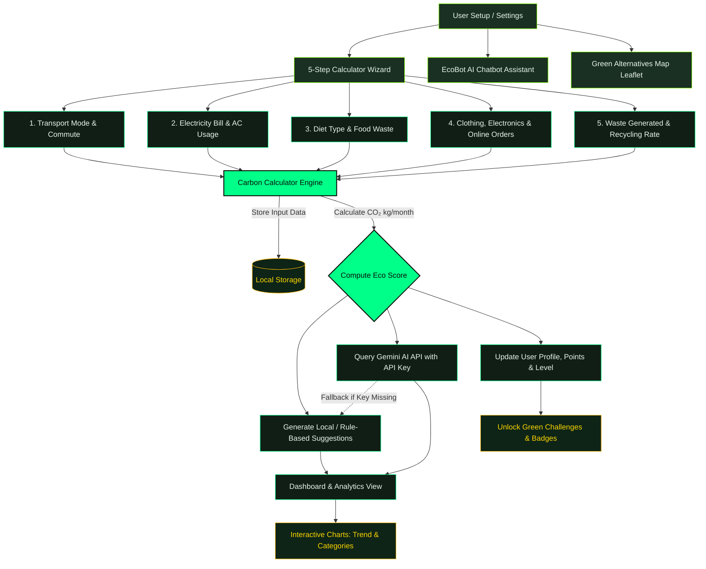

# EcoTrack — Carbon Footprint Awareness Platform 🌿

A full-featured, premium, AI-powered web application for tracking, understanding, and reducing personal carbon footprints, tailored with **India-specific emission factors**.

---

## 🗺️ System Flowchart

Here is the functional architecture of how EcoTrack processes user inputs, calculates carbon footprints, integrates AI suggestions, and updates the gamification system.



---

## 🧮 Calculation Algorithms & Emission Factors

All calculations are adjusted to **India-specific carbon statistics** (Grid factor: `0.82 kg CO₂/kWh`, national annual average target vs Paris Agreement goals).

### 1. Transport Algorithm
Calculates monthly transportation emissions based on commute distance and annual flights.
* **Equation:**
  $$\text{Monthly Emissions} = (\text{Daily Distance} \times \text{Commute Days}) \times \text{EF}_{\text{mode}} + \frac{(\text{Flight Hours} \times 480 \times \text{EF}_{\text{flight}})}{12}$$
* **Emission Factors ($\text{EF}_{\text{mode}}$):**
  - Petrol Car: `0.192 kg CO₂/km`
  - Diesel Car: `0.171 kg CO₂/km`
  - Petrol Bike: `0.113 kg CO₂/km`
  - Electric Vehicle (EV): `0.055 kg CO₂/km` (India grid average)
  - Auto Rickshaw: `0.135 kg CO₂/km`
  - Bus: `0.089 kg CO₂/km`
  - Train: `0.041 kg CO₂/km`
  - Bicycle & Walking: `0 kg CO₂/km`
  - Domestic Flight: `0.255 kg CO₂/km` (assuming speed of $480\text{ km/h}$)

### 2. Home Energy Algorithm
Estimates domestic power consumption and AC usage, applying reductions for solar infrastructure.
* **Equation:**
  $$\text{KWh} = \frac{\text{Monthly Bill}}{8}$$
  $$\text{AC KWh} = \text{AC Hours/Day} \times 1.5 \times 30 \times \left(\frac{\text{AC Months/Year}}{12}\right)$$
  $$\text{Monthly Emissions} = (\text{KWh} + \text{AC KWh}) \times 0.82 \times (1 - \text{Solar Reduction})$$
* **Variables & Factors:**
  - Average Indian Electricity Tariff: `₹8 per kWh`
  - India Grid Emission Factor: `0.82 kg CO₂/kWh`
  - AC Power Consumption (1.5 ton): `1.5 kWh/hour`
  - Solar Panel Reduction: `30%` discount (`0.30`)

### 3. Food & Diet Algorithm
Calculates food footprint using lifestyle diet types and food wastage factors.
* **Equation:**
  $$\text{Monthly Emissions} = (\text{Diet Factor} \times 30) + (\text{Food Waste kg/week} \times 4 \times 1.9)$$
* **Diet Emission Factors ($\text{kg CO₂/day}$):**
  - Non-Vegetarian: `7.2`
  - Eggetarian: `4.5`
  - Vegetarian: `3.8`
  - Vegan: `2.9`
  - Food Waste Factor: `1.9 kg CO₂ per kg` wasted

### 4. Shopping & Electronics Algorithm
Measures carbon embedded in material consumer purchases and delivery services.
* **Equation:**
  $$\text{Monthly Emissions} = (\text{Clothing Items} \times 10) + (\text{Online Deliveries} \times 0.5) + \frac{(\text{New Phone} \times 70) + (\text{New Laptop} \times 400)}{12}$$
* **Embedded Carbon Factors:**
  - Clothing Item: `10 kg CO₂`
  - Electronics (Smartphone): `70 kg CO₂`
  - Electronics (Laptop): `400 kg CO₂`
  - Online Delivery (Last mile transit): `0.5 kg CO₂`

### 5. Household Waste Algorithm
Analyzes landfill waste impact while crediting recycled material values.
* **Equation:**
  $$\text{Total Waste} = \text{Waste kg/week} \times 4$$
  $$\text{Landfill Waste} = \text{Total Waste} \times (1 - \text{Recycle \%})$$
  $$\text{Recycled Waste} = \text{Total Waste} \times \text{Recycle \%}$$
  $$\text{Net Emissions} = (\text{Landfill Waste} \times 0.5 - \text{Recycled Waste} \times 0.1) \times (1 - \text{Compost Reduction})$$
* **Factors:**
  - Landfill Emission Factor: `0.5 kg CO₂/kg`
  - Recycling Offset Credit: `-0.1 kg CO₂/kg`
  - Composting Reduction: `20%` discount if active (`0.20`)

---

## 🏆 Gamification & Eco Scores

Users are scored from **0 to 100** based on their annualized carbon footprint, where a higher score signifies lower emissions.

### Eco Score Formula
$$\text{Annualized Emissions (AE)} = \text{Monthly Total CO₂} \times 12$$
$$\text{Eco Score} = 100 - \left( \frac{\text{AE} - 500}{7500} \times 100 \right)$$
*(Capped between 0 and 100. Lower bound threshold: $500\text{ kg/year}$, Upper bound threshold: $8000\text{ kg/year}$)*

### Tier Rankings
| Score Range | Badge Title | Emoji | Theme Color |
| :--- | :--- | :---: | :--- |
| **80 - 100** | **Eco Champion** | 🌟 | Emerald (`#00ff88`) |
| **60 - 79** | **Green Warrior** | 🌿 | Chartreuse (`#7fff00`) |
| **40 - 59** | **Eco Aware** | 🌱 | Gold (`#ffbb00`) |
| **20 - 39** | **Carbon Conscious** | ⚠️ | Amber (`#ff7700`) |
| **0 - 19** | **High Emitter** | 🔴 | Crimson (`#ff3333`) |

---

## 🚀 Key Features

1. 🧮 **Carbon Calculator** — A sleek 5-step wizard to evaluate transport, energy, food, shopping, and waste footprint.
2. 🤖 **AI-Powered Suggestions** — Personalized advice using the **Google Gemini API** (backed up by an intelligent rule-based fallback system).
3. 🏆 **Green Challenges** — Track and complete weekly challenges to earn points, level up, and unlock achievements.
4. 📊 **Analytics Dashboard** — Modern visualization including Pie, Bar, and Trend charts of your carbon profile compared against Indian and global baselines.
5. 🗺️ **Green Map** — Leaflet-powered maps locating EV charging hubs, public transit connections, recycling depots, and parks.
6. 💬 **EcoBot Chat** — Direct access to an AI chatbot trained to address your questions on sustainability and eco-friendly lifestyles.

---

## 🛠️ Technology Stack

- **Framework**: Next.js 16 (Turbopack) & React 19
- **Data Visualization**: Chart.js & React-Chartjs-2
- **Mapping**: Leaflet.js & React-Leaflet (using OpenStreetMap tiles)
- **AI Core**: `@google/generative-ai` (Gemini API integration)
- **Styling**: Vanilla CSS Modules (featuring glassmorphic theme styling)

---

## 🏁 Getting Started

### 1. Install Dependencies
```bash
npm install
```

### 2. Configure Environment Variables
Create a `.env.local` file in the root directory:
```env
NEXT_PUBLIC_GEMINI_API_KEY=your_google_gemini_api_key_here
```

### 3. Spin Up Development Server
```bash
npm run dev
```
Open **[http://localhost:3000](http://localhost:3000)** in your browser.

---

## 🌍 Emission Standards Reference
- **India Average Annual Footprint**: `1.9 tonnes (1,900 kg) CO₂ per person`
- **Global Average Annual Footprint**: `4.7 tonnes (4,700 kg) CO₂ per person`
- **Paris Agreement Target**: Limit individuals to `2.3 tonnes (2,300 kg) CO₂ per person` by 2030
- *Reference Data Sources: Ministry of Environment (MoEFCC), IEA Country Profiles, India GHG Platform.*

---
*Created with 🌿 for a cleaner, greener planet.*
